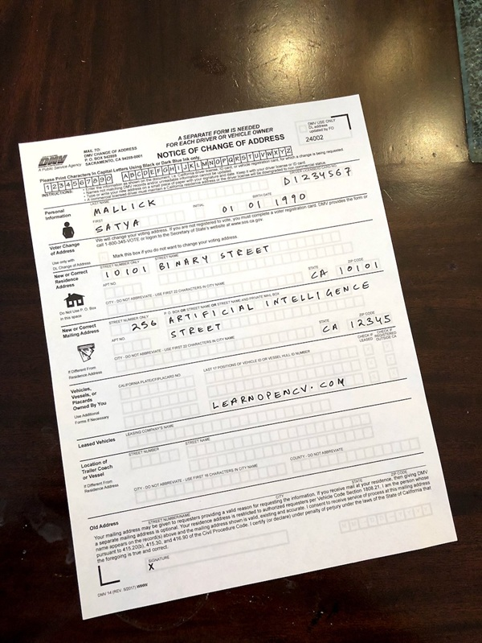
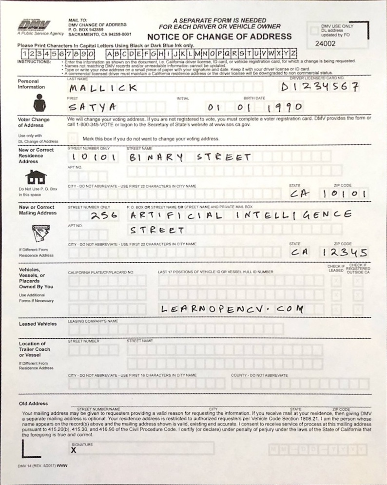

# Document Scanner using OpenCV

This project implements a **Document Scanner** using Python and OpenCV. The scanner detects the four corner points of a document using edge detection and contour approximation, then applies a **perspective transformation** to generate a top-down, flattened, and enhanced version of the scanned document.

## Features

- **Automatic Edge Detection:** Detects document boundaries using the Canny edge detector.

- **Contour Approximation:** Finds and approximates contours to identify a quadrilateral (the document outline).

- **Perspective Transformation:** Warps the document to produce a corrected, rectangular scan.

- **Automatic Output Saving:** Saves the scanned document as a new image file (`scanned-output.jpg`).

- **Lightweight and Fast:** Uses only basic OpenCV operations without heavy deep learning models.

## How It Works
1. **Load the Image:** The application reads the input document image (`scanned-form.jpg`).
2. **Preprocessing:** Converts the image to grayscale, applies Gaussian blur, and performs Canny edge detection to highlight edges.
3. **Contour Detection:** Finds all contours and selects the largest four-point contour that represents the document boundary.
4. **Perspective Warp:** Uses the corner points to apply a perspective transformation for a top-down view.
5. **Save Output:** The scanned document is saved automatically as `scanned-output.jpg`.

## Installation

1. Clone the repository:
   ```bash
   git clone https://github.com/yourusername/document-scanner
   cd document-scanner
   ```
2. Install the required dependencies:
   ```bash
   pip install opencv-python numpy
   ```

## Usage

Run the application with:
```bash
python submission.py 
```
Make sure your input file (`scanned-form.jpg`) is in the same directory as the script, or update the path in the code.

## Project Details

- **Language:** Python
- **Libraries Used:** OpenCV, NumPy
- **Algorithm:**
  - Canny Edge Detection for boundary detection
  - Contour Approximation for corner extraction
  - Perspective Transformation for warping
## Output Example

- The processed and warped document is displayed in a new window.
- The scanned image is automatically saved as scanned-output.jpg in the project folder.

## Example
- **Input Image:**



- **Output Image:**



## Advantages

- Works offline, no heavy dependencies
- Simple and fast execution
- Accurate results for well-lit and clear document images

## Limitations

- Performance may vary under poor lighting or if the document edges are unclear.
- Works best for flat, single-document images with strong contrast.

## Contributing

Contributions are welcome! If you find any issues or have suggestions for improvement, feel free to open an issue or create a pull request.
